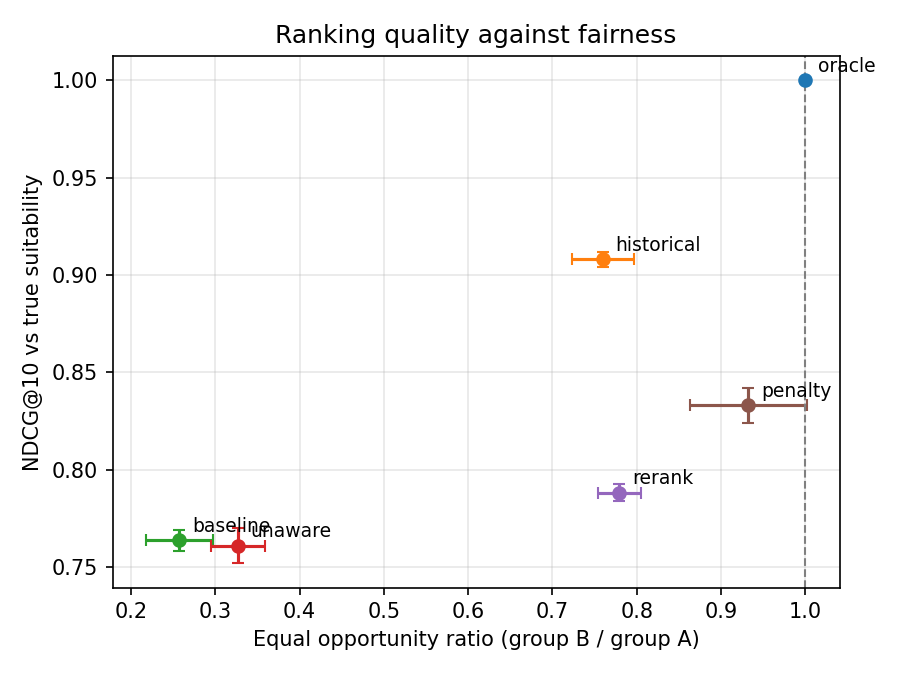
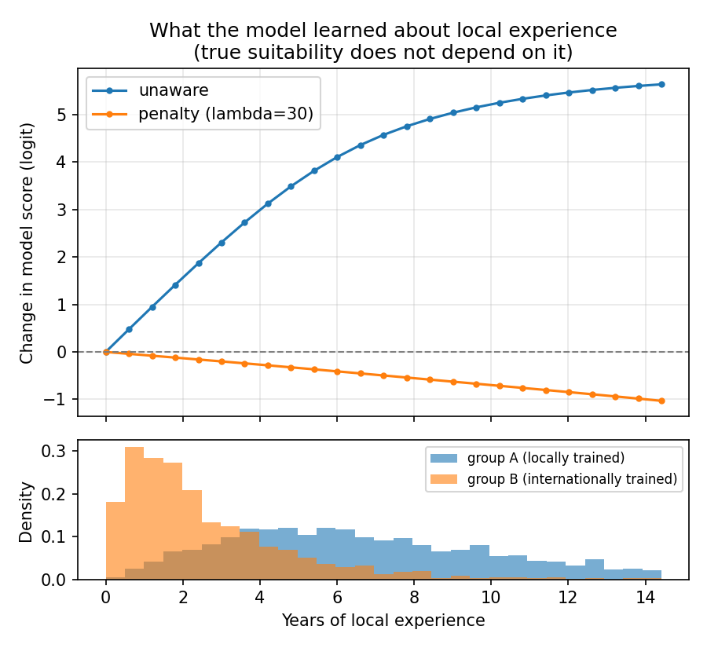

# Fair matching audit: what a candidate-ranking model learns from biased hiring history

**Muhammad Kashif** · [Portfolio](https://kashif-ai-portfolio.netlify.app) · [LinkedIn](https://www.linkedin.com/in/muhammad-kashif-928655142)

## Motivation

I lead the team behind a platform that matches doctors, nurses and other clinicians with hospitals, ranked by a learned model. Matching models learn from past decisions, such as who was shortlisted or who was hired. If those decisions were biased, a model trained on them can reproduce the bias while looking accurate, because it is graded against the same biased decisions.

Real hiring data cannot show this directly: it records who was shortlisted, never how suitable each candidate actually was. This project therefore builds a **synthetic staffing market where true suitability is known**. Past shortlists are then deliberately biased against internationally trained clinicians, and models trained on those shortlists are audited against both views.

No production data or code is used. Everything here is generated.

## Research questions

- **RQ1.** When a ranking model is trained on biased shortlists, how much of the bias does it reproduce? Does removing the group attribute ("fairness through unawareness") help, when a correlated feature (local experience) remains?
- **RQ2.** How do an in-training fairness penalty and a post-processing re-ranker compare in the trade-off between ranking quality and equal opportunity?
- **RQ3.** Does evaluating against historical shortlists hide the problem? In other words, does the "most accurate" model on biased labels actually rank truly suitable candidates worse?

## The synthetic market

Generated in `fairmatch/synthetic.py`; every number is in `config.yaml`.

- **5,000 candidates, 300 jobs**, 40 applicants per job (70% from the job's specialty).
- **30% of candidates are internationally trained (group B).** They have the same distribution of total experience, specialties, licences and certifications as group A, but less *local* experience.
- **True suitability:** specialty match, experience relative to the job's requirement (with diminishing returns), certifications, a valid licence, shift-hours fit, same region, and noise. **Group plays no part.**
- **Past shortlists:** the top 20% of each pool by what past recruiters judged. That judgement is true suitability, minus a penalty for group B (`bias`, default 1.0), plus an over-reward for local experience (`local_bias`, 0.8), plus noise.
- Graded relevance for evaluation, from true suitability within each pool:
  - 3 = top 10%;
  - 2 = next 15%;
  - 1 = next 25%.

  "Qualified" means relevance ≥ 2.

Because merit is independent of group by construction, parity is the right target here. In real data that assumption would itself need evidence (see Limitations).

## Models and mitigations

All models are a small PyTorch MLP (two hidden layers of 32) that scores candidate-job pairs. Each is trained with binary cross-entropy on past shortlists, on 70% of jobs, and tested on the other 30%.

| Variant | Description |
|---|---|
| `oracle` | Rank by true suitability (upper bound, not a model) |
| `historical` | Rank by the past shortlist decisions themselves |
| `baseline` | Model with all features, including group |
| `unaware` | Model without the group feature ("fairness through unawareness") |
| `penalty` | `unaware` plus a training penalty λ·(mean score A − mean score B)² per mini-batch; group is used only in the loss, never as an input |
| `rerank` | `unaware` scores, re-ranked so group B holds at least its pool share of every top-k prefix (a simplified FA*IR, Zehlike et al., 2017) |

## Metrics (top 10 per job, averaged over test jobs)

- **NDCG@10 vs true suitability:** how well the ranking serves the job.
- **NDCG@10 vs past shortlists:** what a standard offline evaluation would report.
- **Equal opportunity ratio:** among *truly qualified* candidates, group B's rate of reaching the top 10 divided by group A's (Hardt et al., 2016). 1.0 = parity.
- **Selection ratio:** the same ratio over all candidates (demographic parity).
- **Exposure ratio:** position-weighted attention per group member (Singh & Joachims, 2018).

Each configuration is run with **5 seeds**; each seed is a new market and a new model. Tables report mean ± standard deviation.

Three experiments:
1. Main comparison at `bias = 1.0`.
2. A λ sweep for the penalty.
3. A bias sweep (`bias` from 0 to 1.5) to check that the audit detects bias when it is there, and none when it isn't.

## Results

Full tables: [`results/RESULTS.md`](results/RESULTS.md). Mean ± standard deviation over 5 seeds; `bias = 1.0`; penalty λ = 30.

| Variant | NDCG@10 (true) | NDCG@10 (past shortlists) | Equal opportunity ratio | Selection ratio |
|---|---|---|---|---|
| oracle | 1.000 | 0.744 | 1.00 | 1.03 |
| historical | 0.908 | 1.000 | 0.76 | 0.59 |
| baseline | 0.764 ± 0.005 | **0.757** ± 0.006 | 0.26 ± 0.04 | 0.18 ± 0.04 |
| unaware | 0.761 ± 0.009 | 0.746 ± 0.004 | 0.33 ± 0.03 | 0.25 ± 0.03 |
| rerank | 0.788 ± 0.004 | 0.697 ± 0.006 | 0.78 ± 0.03 | 0.84 ± 0.01 |
| penalty | **0.833** ± 0.009 | 0.695 ± 0.007 | **0.93** ± 0.07 | 0.93 ± 0.10 |



**RQ1: the model does not just copy the bias, it amplifies it.**
- Past recruiters gave truly qualified group-B candidates 76% of group A's chance of a top-10 place.
- The baseline model trained on their decisions gave them **26%**. The model learns the systematic part of the recruiters' bias and applies it consistently, without the noise that let some group-B candidates through.
- Removing the group attribute helps only a little (26% → 33%), because local experience carries the same signal.
- The bias sweep shows the same pattern at every bias level. Even with no direct bias (`bias = 0`), the over-reward for local experience alone leaves the unaware model at 0.76, against 0.94 in the historical decisions.

**RQ2: the in-training penalty beats re-ranking on both axes.**
- The penalty raised the equal opportunity ratio to 0.93 *and* raised true ranking quality from 0.761 to 0.833.
- Re-ranking reached 0.78 with a smaller quality gain (0.788). It guarantees group B's share of the top 10, but it cannot correct the order *within* each group, which the biased model also got wrong.
- The λ sweep (`results/figures/lambda_sweep.png`) shows most of the gain arriving by λ = 10, with no further improvement past λ = 30.

**RQ3: the standard evaluation rewards the biased model.**
- Scored against past shortlists, the ranking a team would normally use for model selection, the baseline looks best (0.757) and the penalty model worst (0.695).
- Scored against true suitability, the order reverses (0.764 vs 0.833).
- A team choosing models by offline accuracy on historical decisions would pick the most biased model and conclude that fairness costs accuracy, when here it improved it.

**Inside the model: the proxy.** Partial dependence (`python -m fairmatch.inspect_proxy`, seed 0):
- Moving every test candidate's local experience from 0 to 14 years raises the unaware model's score by **+5.6 logits**, although true suitability does not depend on local experience at all.
- The penalty model learns a small *negative* slope (−1.0). It reaches parity partly by discounting local experience slightly, i.e. a mild over-correction.



### Robustness

The full experiment was re-run (5 seeds) with one assumption changed at a time. Configs are in `robustness/`; results are in `results/robustness/`.

| Setting | Historical EO | Baseline EO | Unaware EO | Rerank EO | Penalty EO | Penalty NDCG@10 (true) vs unaware |
|---|---|---|---|---|---|---|
| Main (bias 1.0, local reward 0.8, 30% group B) | 0.76 | 0.26 | 0.33 | 0.78 | 0.93 | 0.833 vs 0.761 |
| No reward for local experience | 0.80 | 0.33 | 0.45 | 0.83 | 0.98 | 0.839 vs 0.783 |
| Smaller minority (10% group B) | 0.82 | 0.18 | 0.34 | 0.59 | 0.77 ± 0.18 | 0.819 vs 0.814 |

- **Amplification holds in both settings.** Even when recruiters did not reward local experience, the model still used it as a proxy for group, because the two are correlated.
- **The penalty is less reliable for a small minority.** With 10% group B, a 256-row mini-batch contains only about 25 group-B rows. The penalty's batch averages become noisy, and both its effect and its quality gain shrink. Larger batches, or a penalty computed over a running average, are the obvious fixes to test next.

**What this means for real matching platforms.** Offline metrics computed on past hiring decisions cannot, on their own, tell a fair model from an unfair one. Audits need an independent signal of suitability, such as later performance or retention, or structured human review. They also need fairness metrics computed on qualified candidates, not only overall selection rates.

## Limitations

- **Synthetic data:** the findings show how these methods behave under a known, simple bias mechanism, not how large bias is in any real market. The value is that the ground truth is known, which real data never offers.
- **One protected attribute with two groups;** real audits need intersectional groups.
- **Parity is the right target only because merit is independent of group by construction.** With real data, differences in the data may reflect unequal opportunity earlier in life, or genuine differences, and choosing the fairness target is a normative decision.
- The penalty uses group labels at training time, which may not be available or lawful to collect in every jurisdiction.
- The re-ranker enforces a floor in the top 10 only; positions after 10 keep the model's order.

## Next steps

- Listwise training (e.g. softmax over each job's pool) instead of pointwise.
- Estimate bias from observational data alone, without the synthetic ground truth, and check the estimate against the known truth.
- Two-sided fairness: also consider how exposure is shared across hospitals.
- A penalty that stays stable for small minorities (larger batches, or a running estimate of the group gap).

## How to run

```bash
python -m venv .venv
.venv\Scripts\activate            # on macOS/Linux: source .venv/bin/activate
pip install -r requirements.txt   # CPU PyTorch is enough

python -m pytest                        # tests
python -m fairmatch.experiment --quick  # smoke test, about a minute
python -m fairmatch.experiment          # full run, CPU, see the guide for timing
python -m fairmatch.report              # rebuild tables and figures from results/runs.csv
python -m fairmatch.inspect_proxy       # partial-dependence plot for local experience
python -m fairmatch.experiment --config robustness/no_local_reward.yaml   # robustness runs
python -m fairmatch.experiment --config robustness/small_minority.yaml
```

## Project layout

```
fairmatch/
  synthetic.py    market generator: candidates, jobs, pools, true suitability, biased shortlists
  model.py        PyTorch scorer and training loop with optional fairness penalty
  rerank.py       proportional re-ranking
  metrics.py      NDCG, equal opportunity, selection and exposure ratios
  experiment.py   the three experiments, results/runs.csv
  report.py       tables and figures
  inspect_proxy.py  partial dependence of the score on local experience
robustness/       configs for the robustness runs
tests/            generator, metric, re-ranker and pipeline tests
```

## References

- Hardt, M., Price, E., & Srebro, N. (2016). Equality of opportunity in supervised learning. *NeurIPS*.
- Singh, A., & Joachims, T. (2018). Fairness of exposure in rankings. *KDD*.
- Zehlike, M., Bonchi, F., Castillo, C., Hajian, S., Megahed, M., & Baeza-Yates, R. (2017). FA*IR: A fair top-k ranking algorithm. *CIKM*.
- Järvelin, K., & Kekäläinen, J. (2002). Cumulated gain-based evaluation of IR techniques. *ACM TOIS*.
- Raghavan, M., Barocas, S., Kleinberg, J., & Levy, K. (2020). Mitigating bias in algorithmic hiring: Evaluating claims and practices. *FAT\**.

## Licence

MIT.
